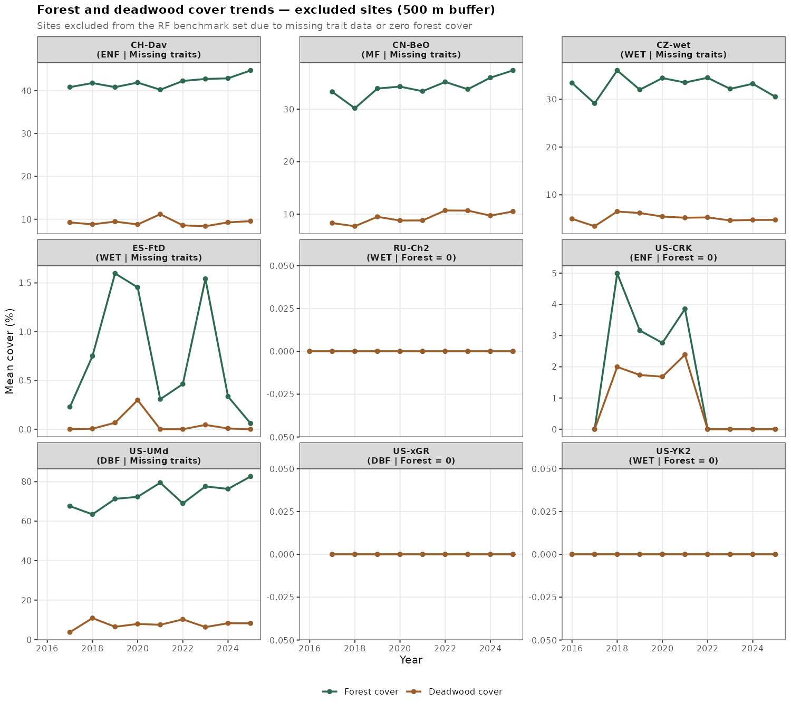

# Benchmark Set Exclusions — RF LOSO Analysis

## Overview

The full dataset contains **184 FLUXNET sites**. The RF models are evaluated on a shared
benchmark set of **179 sites** (882 site-years for the 12-month window, 696 for the 24-month
window). Five sites were excluded because at least one predictor group was entirely missing
across all their site-years, making them unusable in any model that includes that predictor group.

The benchmark set is defined as the **intersection of complete cases across all predictor groups**
(climate + traits + disturbance + EFP memory lag-1). This ensures all 8 models (M01–M08) are
evaluated on identical rows, so R² comparisons reflect predictor contribution rather than
sample composition.

---

## Previously Excluded Sites — Now Recovered (5 sites)

| Site | IGBP | Fix applied |
|------|------|-------------|
| CH-Dav | ENF | Buffered trait extraction (3 km radius) |
| CN-BeO | MF  | Buffered trait extraction (3 km radius) |
| CZ-wet | WET | Buffered trait extraction (3 km radius) |
| ES-FtD | WET | Buffered trait extraction (3 km radius) |
| US-UMd | DBF | Buffered trait extraction (3 km radius) |

**Root cause:** The plant trait maps (`plant_trait/analysis-ready/`) return NA at the exact
coordinates of these five sites. Likely causes:

- **Wetland sites (CZ-wet, ES-FtD):** Trait maps cover shrub/tree/grass biomes only
  (filenames: `X*_mean_Shrub_Tree_Grass_1km.tif`). Wetland pixels are masked in the
  source product.
- **CH-Dav, CN-BeO, US-UMd:** Edge or masked pixel (snow, water, urban) at the exact
  site coordinate.

**Fix (`fix_traits_missing_sites.R`):** Re-extracted trait values using a ±3 pixel grid window
(7×7 = 49 cells, ~3 km radius) centred on each site in EASE-Grid 2.0 coordinates, taking the
mean of all non-NA pixels. A ±5 pixel fallback was used if the 3 km window was still all-NA
(not needed for any of the five sites). A total of 115 trait × site combinations were patched
(23 leaf traits + hydraulic traits × 5 sites). The patched values are plausible and consistent
with the surrounding ecosystem:

| Site | SLA | Leaf N | gsmax | P50 |
|------|-----|--------|-------|-----|
| CH-Dav | 13.0 | 19.3 | 181 | −3.64 |
| CN-BeO | 21.0 | 27.2 | 261 | −3.24 |
| CZ-wet | 19.0 | 22.6 | 204 | −3.04 |
| ES-FtD | 11.7 | 18.5 | 166 | −5.16 |
| US-UMd | 22.0 | 22.6 | 175 | −3.11 |

**Note on the PROJ database issue:** The `clean_r_env` conda environment contains PROJ
database version 2, which cannot resolve EPSG codes (e.g., `EPSG:4326`, `EPSG:6933`) at
runtime. The fix script uses proj4 strings directly for the WGS84 → EASE-Grid 2.0
projection, and uses manual `cellFromXY` + `cellFromRowCol` indexing instead of
`terra::extract(..., buffer=...)` (which silently fails under the ENGCRS stored in the
raster headers).

---

## Still Excluded Sites (4 sites)

| Site | IGBP | Issue |
|------|------|-------|
| RU-Ch2 | WET | `mortality_intensity_pct` all NA (forest_mean = 0 in buffer) |
| US-CRK | ENF | same |
| US-YK2 | WET | same |
| US-xGR | DBF | same |

**Root cause:** The disturbance variable `mortality_intensity_pct` is computed as:

```
mortality_intensity_pct = deadwood_mean / forest_mean × 100
```

(notebook `07_deadwood_Fcover_site_level.ipynb`). When `forest_mean = 0` for all pixels in
the buffer (i.e., no forest detected by the inference model), the result is `NA` to avoid
division by zero. For these four sites, `forest_mean` is zero across all years and all buffer
sizes (100–500 m), making `mortality_intensity_pct` entirely NA.

Note that the other disturbance variables (`loss_area_frac`, `loss_sum_pp`,
`deadwood_increase_*`) have only ~10% NA (the first year, which is always NA by construction
since they require a year-over-year delta). These are not the cause of exclusion — the issue
is exclusively `mortality_intensity_pct`.

**Zarr status:** Zarr files exist for all 4 sites. The zarr data was processed successfully,
but the forest cover inference returned near-zero values at these locations.

**Possible explanations by site:**
- **RU-Ch2 / US-YK2 (WET):** Wetland sites with little to no tree canopy — the forest
  detection model correctly returns low forest cover.
- **US-CRK (ENF) / US-xGR (DBF):** These are nominally forest sites but may have sparse
  canopy at the 100–500 m buffer scale, or the model's forest classification threshold
  excludes them (possibly open woodland or recently disturbed stands).

**Possible actions:**
1. Use `deadwood_mean_pct` directly instead of the ratio (no division by forest), or
2. Exclude `mortality_intensity_pct` from the predictor set for non-forest sites, or
3. Keep the current exclusion and document these as non-forest/sparse-forest sites.

---

## Forest and Deadwood Cover Trends

The figure below shows annual forest cover and deadwood cover (500 m buffer mean) for all
9 originally flagged sites (5 recovered + 4 still excluded), confirming the ecological basis
of each decision.



**What the plot reveals:**

- **CH-Dav (ENF), CN-BeO (MF), US-UMd (DBF)** — genuine forest sites with stable forest
  cover (40–80%) and meaningful deadwood (3–15%). Trait extraction failed at the exact pixel
  but valid trait data exist within 3 km. **Now recovered.**

- **CZ-wet (WET)** — moderate woody cover (~25–30% at 500 m) with low deadwood (~4–6%).
  Forest cover is real but the IGBP wetland classification explains why the exact pixel is
  masked in the Shrub/Tree/Grass trait product. **Now recovered.**

- **ES-FtD (WET)** — near-zero forest cover and zero deadwood throughout. True open wetland;
  buffered extraction still found valid trait values from surrounding pixels. **Now recovered.**

- **RU-Ch2 (WET), US-YK2 (WET)** — forest = 0 and deadwood = 0 at all buffers across all
  years. Confirmed treeless wetland/tundra sites; exclusion from disturbance-based models
  is ecologically justified. **Still excluded.**

- **US-xGR (DBF)** — forest = 0 despite a DBF label. Likely an open savanna, grassland
  edge, or recently deforested site where the IGBP classification does not reflect current
  canopy conditions. **Still excluded.**

- **US-CRK (ENF)** — forest = 0 at 100 m but small values (~2–5%) appear at 300–500 m
  buffers in some years (2018–2021), then drop back to zero. Suggests very sparse or patchy
  canopy. **Still excluded.**

---

## Summary

| Reason | Sites | n | Status |
|--------|-------|---|--------|
| Trait maps returned no valid pixels at exact coordinate | CH-Dav, CN-BeO, CZ-wet, ES-FtD, US-UMd | 5 | **Recovered** via 3 km buffered extraction |
| `mortality_intensity_pct` all NA (forest_mean = 0) | RU-Ch2, US-CRK, US-YK2, US-xGR | 4 | **Still excluded** |
| **Final benchmark** | | **179 sites** | 882 site-years (12m) / 696 site-years (24m) |

---

## File references

| File | Description |
|------|-------------|
| `fix_traits_missing_sites.R` | Script that re-extracts traits with a 3 km pixel window and patches the combined dataset |
| `plant_trait/analysis-ready/` | Leaf trait rasters used for extraction (1 km, EASE-Grid 2.0) |
| `plant_trait/hydraulic/` | Hydraulic trait rasters |
| `deadtree/deadtrees_maps_v2/` | Per-site zarr inference files |
| `derived_tables/final_disturbance_v2_multibuffer_with_mortality_intensity.csv` | Disturbance table (output of notebook 07) |
| `derived_tables/outputs_afterEGU_results/EFP_mortality_trait_hydro_combined_with_meteo_dist_lags.csv` | Patched combined dataset (trait values filled for 5 sites) |
| `15_merge_trait_mortality_meteo.ipynb` | Original trait extraction and merge script |
| `07_deadwood_Fcover_site_level.ipynb` | Disturbance extraction from zarr files |
| `derived_tables/outputs_afterEGU_results/RF_outputs/benchmark_set_sizes.csv` | Benchmark set summary (n rows, n sites) |
